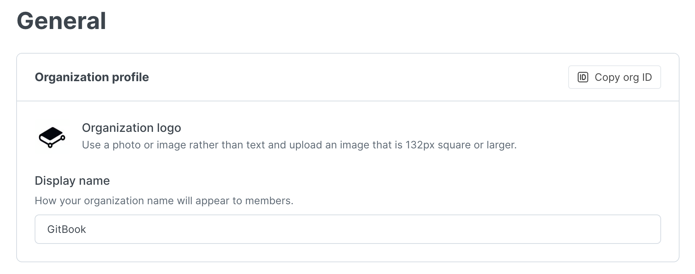
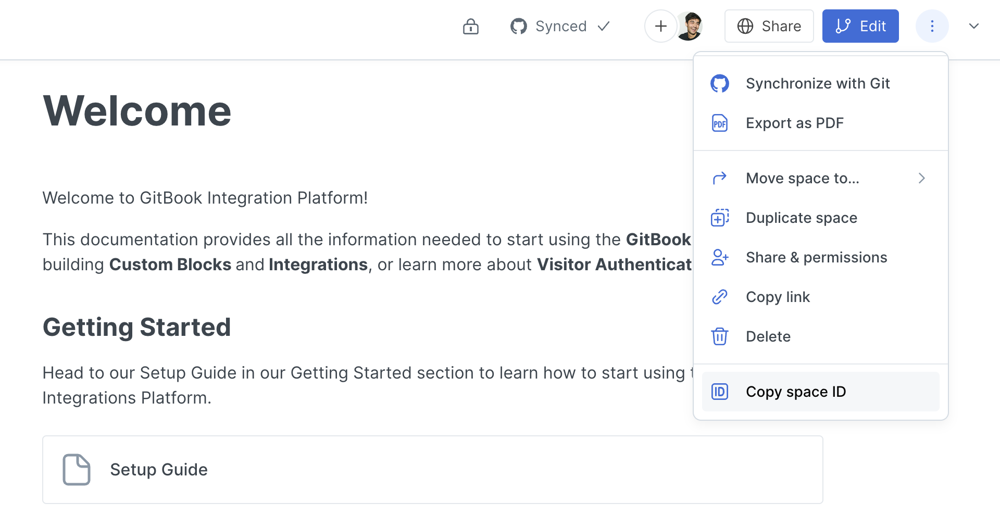
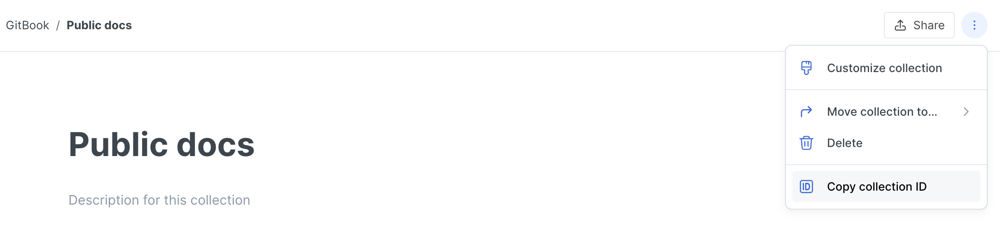

# Concepts

Throughout the GitBook Integration Platform and it's documentation, there are different concepts, variables, and terms used as you continue to explore. Below you can find more information about these concepts and where to find them in the GitBook app.

### `<organizationId>`

A unique identifier of an Organization in GitBook. You can find the organization ID in the URL of any space you're in.&#x20;

Alternatively, you can click the "Copy org ID" button when viewing your organization's settings.

<figure><figcaption>
Copy org ID
</figcaption></figure>

**Example**

| URL                                                | Organization ID |
| -------------------------------------------------- | --------------- |
| https://app.gitbook.com/o/6DshSpVsoE/s/I6OHwf4UHU/ | `6DshSpVsoE`    |

### `<spaceId>`

A unique identifier of a Space in GitBook. You can find the space ID in the URL of any space you're in.

Alternatively, you can click the "Copy space ID" button from the dropdown menu in the upper right corner when viewing a space.

<figure><figcaption>
Copy space ID
</figcaption></figure>

**Example**

| URL                                                | Space ID     |
| -------------------------------------------------- | ------------ |
| https://app.gitbook.com/o/6DshSpVsoE/s/I6OHwf4UHU/ | `I6OHwf4UHU` |

### `<collectionId>`

A unique identifier of a collection in GitBook. You can find the collection ID in the URL of any collection page you're in.

Alternatively, you can click the "Copy collection ID" button from the dropdown menu in the upper right corner when viewing a collection.

<figure><figcaption>
Copy collection ID
</figcaption></figure>

**Example**

| URL                                                | Collection ID |
| -------------------------------------------------- | ------------- |
| https://app.gitbook.com/o/6DshSpVsoE/c/fj08dm76dh2 | `fj08dm76dh2` |

### `<userId>`

A unique identifier of a User in GitBook. You can find your User ID from calling the [`GET` Current User endpoint](../gitbook-api/reference/users.md#get-current-user) in the GitBook API.

Alternatively, you can click the "Copy user ID" button from the dropdown when viewing a member within an organization.

<figure><figcaption>
Copy user ID
</figcaption></figure>

### `gitbook-manifest.yaml`

A required file in a GitBook integration that contains information for publishing and developing your app. See the [Configurations section](../integrations/configurations.md) for more info.

### `.gitbook-dev.yaml`

A required file in a GitBook integration containing information about developing your app. See the [Development section](development.md) for more info.
