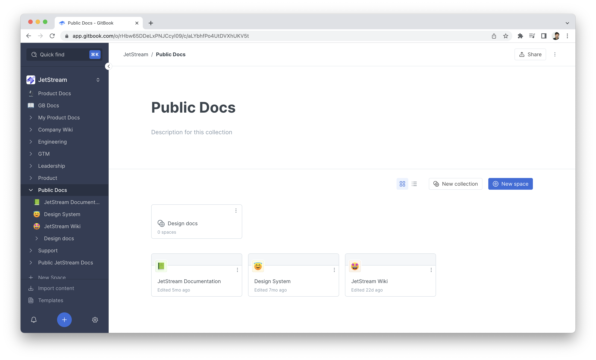

# Collections

<figure><figcaption></figcaption></figure>

### `GET` a specific collection


[https://api.gitbook.com/openapi.json](https://api.gitbook.com/openapi.json)


### `GET` spaces in a collection


[https://api.gitbook.com/openapi.json](https://api.gitbook.com/openapi.json)



[https://api.gitbook.com/openapi.json](https://api.gitbook.com/openapi.json)


### `GET` permissions for all users in a collection


[https://api.gitbook.com/openapi.json](https://api.gitbook.com/openapi.json)


