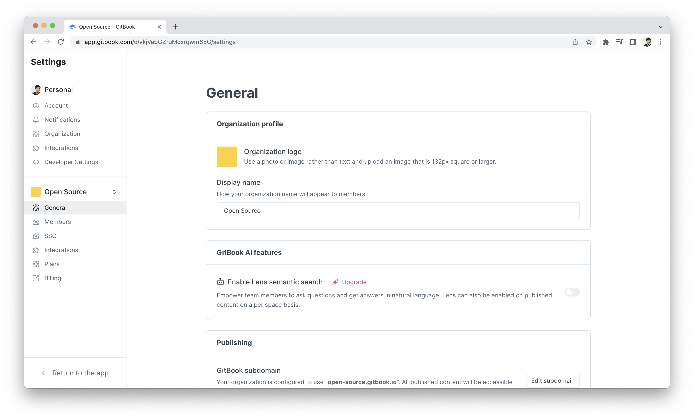

# Organizations

<figure><figcaption></figcaption></figure>

### `GET` organizations for current user


[https://api.gitbook.com/openapi.json](https://api.gitbook.com/openapi.json)


### `GET` collections in an organization


[https://api.gitbook.com/openapi.json](https://api.gitbook.com/openapi.json)


### `GET` spaces in an organization


[https://api.gitbook.com/openapi.json](https://api.gitbook.com/openapi.json)


### `POST` an invite to an organization


[https://api.gitbook.com/openapi.json](https://api.gitbook.com/openapi.json)

