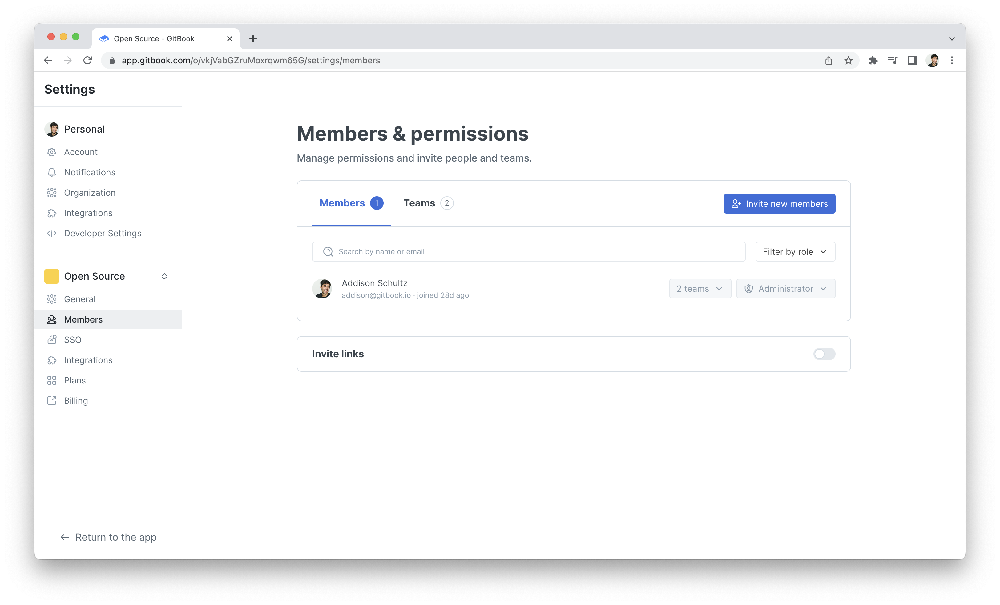

# Members

<figure><figcaption></figcaption></figure>

### `GET` members in an organization


[https://api.gitbook.com/openapi.json](https://api.gitbook.com/openapi.json)


### `GET` a specific member in an organization


[https://api.gitbook.com/openapi.json](https://api.gitbook.com/openapi.json)


### `PATCH` a specific member in an organization


[https://api.gitbook.com/openapi.json](https://api.gitbook.com/openapi.json)


### `DELETE` a specific member in an organization


[https://api.gitbook.com/openapi.json](https://api.gitbook.com/openapi.json)


### `POST` a user as an SSO member in an organization


[https://api.gitbook.com/openapi.json](https://api.gitbook.com/openapi.json)

