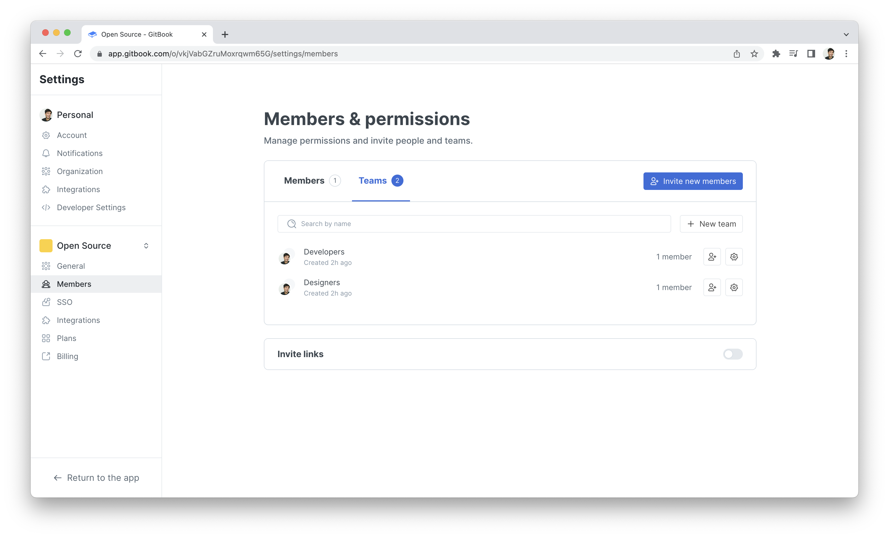

# Teams

<figure><figcaption></figcaption></figure>

### `GET` teams in an organization


[https://api.gitbook.com/openapi.json](https://api.gitbook.com/openapi.json)


### `PUT` a team in an organization


[https://api.gitbook.com/openapi.json](https://api.gitbook.com/openapi.json)


### `GET` a specific team in an organization


[https://api.gitbook.com/openapi.json](https://api.gitbook.com/openapi.json)


### `PATCH` a specific team in an organization


[https://api.gitbook.com/openapi.json](https://api.gitbook.com/openapi.json)


### `DELETE` a specific team in an organization


[https://api.gitbook.com/openapi.json](https://api.gitbook.com/openapi.json)


### `GET` team members in an organization


[https://api.gitbook.com/openapi.json](https://api.gitbook.com/openapi.json)


### `PUT` team members in an organization


[https://api.gitbook.com/openapi.json](https://api.gitbook.com/openapi.json)


### `PUT` a specific team member in an organization


[https://api.gitbook.com/openapi.json](https://api.gitbook.com/openapi.json)


### `DELETE` a specific team member in an organization


[https://api.gitbook.com/openapi.json](https://api.gitbook.com/openapi.json)

