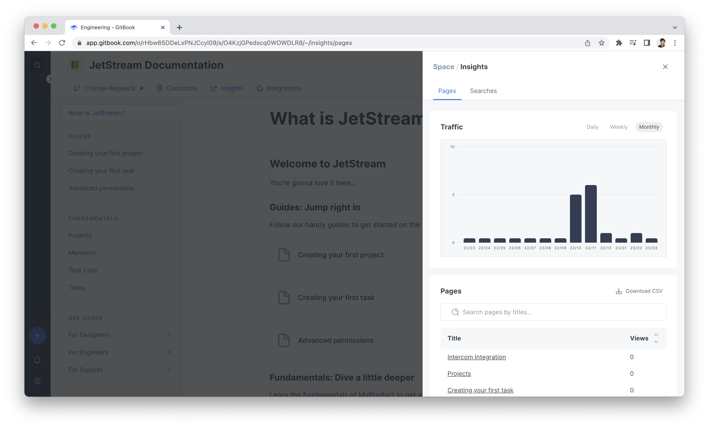

# Insights

<figure><figcaption></figcaption></figure>

### `GET` content analytics for a specific space


[https://api.gitbook.com/openapi.json](https://api.gitbook.com/openapi.json)


### `GET` search analytics for a specific space


[https://api.gitbook.com/openapi.json](https://api.gitbook.com/openapi.json)


### `GET` page traffic analytics for a specific space


[https://api.gitbook.com/openapi.json](https://api.gitbook.com/openapi.json)

