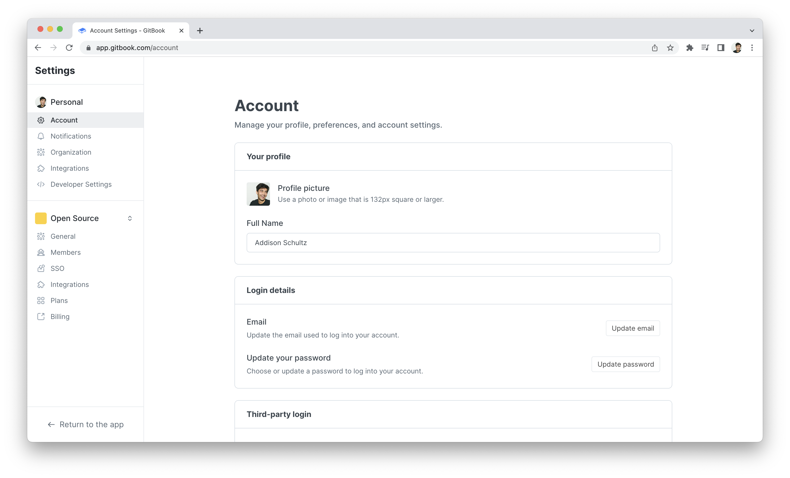

# Users

<figure><figcaption></figcaption></figure>

### `GET` current user


[https://api.gitbook.com/openapi.json](https://api.gitbook.com/openapi.json)


### `GET` user by ID


[https://api.gitbook.com/openapi.json](https://api.gitbook.com/openapi.json)

