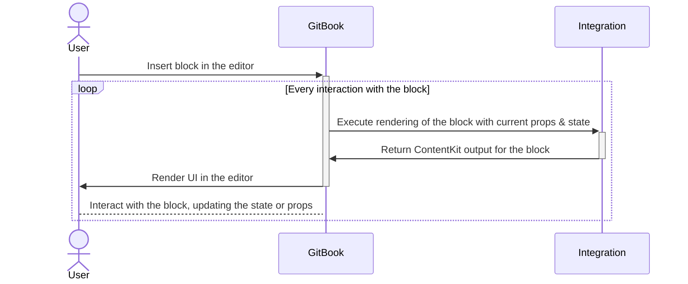

# Blocks

Integrations can create custom blocks for documents. Blocks are small unit of content in a page document (like a paragraph, table, embed, etc.).

## Define a custom block

Custom blocks are defined in the integration's manifest file:

```yaml
blocks:
  - id: helloworld
    title: Hello World
```

All blocks defined in an installed integrations will be listed in the insertion palette for all editors of the space.

## Execution flow for a block

Rendering of custom blocks is controlled in the integration's code and executed in the GitBook backend.



## Render a basic block

Block are being rendered in the [ContentKit format](../contentkit/).

```typescript
import { createComponent, createIntegration } from '@gitbook/runtime';

const helloWorld = createComponent({
  componentId: 'helloworld',
  async render() {
    return (
      <block>
        <box>
          <text>Hello world</text>
        </box>
      </block>
    );
  }
});

export default createIntegration({
  components: [helloWorld]
});
```
