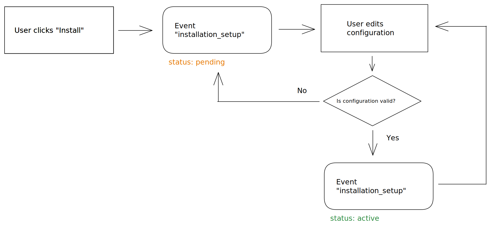

# Configuration

Integrations are defined through a file called `gitbook-manifest.yaml`. This file is automatically created through the CLI when creating a new integration.

<mark style="color:red;">\*required</mark>

### Name<mark style="color:red;">\*</mark>

The name of your integration. Must be unique across all GitBook integrations.

**Example:**

```yaml
name: slack
```

### Title<mark style="color:red;">\*</mark>

The title of your integration.

**Example:**

```yaml
title: Slack
```

### Description<mark style="color:red;">\*</mark>

A short description for your integration.

**Example:**

```yaml
description: Notify a channel or individual in Slack with real-time events from GitBook.
```

### Organization<mark style="color:red;">\*</mark>

The `id` or `subdomain` of the organization that owns this integration.

**Example:**

```yaml
organization: gitbook
```

### Visibility<mark style="color:red;">\*</mark>

The visibility for your integration.

<table><thead><tr><th width="243.5546875" valign="top">Visibility</th><th>Description</th></tr></thead><tbody><tr><td valign="top"><code>private</code></td><td>Default for new integrations. Only members from the organization defined in the integration's manifest will be able to install the integration.</td></tr><tr><td valign="top"><code>unlisted</code></td><td>Members from any organization can install the integration. The integration will only be available to install via it's shared install link.</td></tr><tr><td valign="top"><code>public</code></td><td>Members from any organization can install the integration. Integrations wanting to submit to the marketplace must use this visibility.</td></tr></tbody></table>

**Example:**

```yaml
visibility: private
```

### Scopes<mark style="color:red;">\*</mark>

The scopes your integration has permissions for.

**Example:**

<pre class="language-yaml"><code class="lang-yaml"><strong>scopes:
</strong>  - space:content:read
  - space:content:write
  - space:metadata:read
  - space:metadata:write
  - space:views:read
</code></pre>


You may see the scope `site:script:inject` throughout GitBook owned integrations—This scope is only available for internal GitBook use.


Building integrations that inject JavaScript into a space or page are not possible to build at this time.


### Script

The main script to execute for your integration. Should contain the call [`createIntegration()`](runtime.md#createintegration).

**Example:**

```yaml
script: ./src/index.ts
```

### Blocks

Component block(s) referenced by `name` to render in the ( ⌘ + / ) menu. See [`createComponent()`](runtime.md#createcomponent) to learn more.

**Example:**

```yaml
blocks:
  - id: example-block
    title: Exmple Block
    description: An example block for a GitBook Integration
```

### Categories

A list of categories your integration falls into.

**Example:**

```yaml
categories:
    - analytics
    - collaboration
    - content
    - marketing
    - visitor-auth
    - other
```

### Summary

A summary for your integration displayed on the installation page. Supports Markdown.

**Example:**

```yaml
summary: |
    # Overview
    The GitBook Slack integration brings the power of GitBook to your Slack workspace. Your teams have instant access to your GitBook knowledge base, without leaving Slack.
    # Configure
    You can install the integration on a single space by clicking the integrations button in sub-navigation panel. If you prefer to install the Slack integration on multiple on all spaces you can enable this through organization settings. To configure the integration you will have to authorize the connection between Slack and GitBook. You can also select the default channel to post messages to.
```

### Icon

A locally referenced icon for your integration. Asset must be located alongside the code for your integration.

**Example:**

```yaml
icon: ./assets/icon.png
```

### Preview Images

A list of locally referenced assets to display on the installation page for your integration.

**Example:**

```yaml
previewImages:
    - ./assets/slack-preview.png
```

### External Links

A list of URLs to display on the installation page for your integration. Each link requires a `label` and a `url`.

**Example:**

```yaml
externalLinks:
    - label: Documentation
      url: https://www.gitbook.com/integrations/slack
    - label: Slack Homepage
      url: https://slack.com/
```

### Configurations

The configurations key allows you to specify specific steps and configurations for your integration through it's `environment`.&#x20;

You're able to set up default configurations under the `configurations.account` key, and site-specific configurations through the `configurations.site` key.

All configurations accept `properties`, which are named keys used to describe the different steps your user will go through as they install your integration. You can also name these properties in a `required` key to enforce certain configurations.

You can create as many properties as you would like, and can be of the following:

**`string`**

String configurations can be used to collect user input. You can use optional keys `enum` or `completion_url` to provide a list of items from a dropdown list instead than an input.

`enum` allows you to specify a list of items, while `completion_url` allows you to fetch options from an endpoint. See the [Slack configuration](../../integrations/slack/gitbook-manifest.yaml) to learn more.

```yaml
string_property:
    type: string
    title: String Property
    description: A short description
    default: A default Value
    
    # Optional key to provide a list of options
    enum:
      - item 1
      - item 2
      - item 3
      - item 4
    
    # Optional key to fetch a list of entries from an endpoint.
    completion_url: /completion-endpoint
```

**`number`**

```yaml
number_property:
    type: number
    title: Number Property
    description: A short description
    default: 1
```

**`boolean`**

```yaml
boolean_property:
    type: boolean
    title: Boolean Property
    description: A short description
    default: true
```

**`button`**

Button configurations can be used if you need to set up an OAuth connection with a provider in order to use your integration. See [`createOAuthHandler()`](runtime.md#createoauthhandler) for more information.

```yaml
button_property:
    type: button
    title: Button Property
    description: A short description
    button_text: Authorize
    callback_url: /callback-url
```

**Example Configuration:**

```yaml
configurations:
    account:
        properties:
            oauth_credentials:
                type: button
                title: Connection
                description: Authorization between Slack and GitBook.
                button_text: Authorize
                callback_url: /oauth
            default_channel:
                type: string
                title: Default Channel
                description: Select a channel to post messages to, when none is configured for a specific space.
                completion_url: /channels
        required:
            - oauth_credentials
            - default_channel
    site:
        properties:
            channel:
                type: string
                title: Channel
                description: Select a channel to post messages related to this space.
                completion_url: /channels
            notify_content_update:
                type: boolean
                title: Notify Content Update
                description: Post a notification message every time the content of the space is updated.
                default: true
            notify_visibility_update:
                type: boolean
                title: Notify Visibility Update
                description: Post a notification message every time the visibility of the space is updated.
                default: true
```

### Secrets

A list of secrets or environment variables that your integration might need in order to function. By default, environment variables are not loaded into GitBook's Manifest file.&#x20;

We recommend using a package like [`dotenv-cli`](https://www.npmjs.com/package/dotenv-cli) to include environment variables in your integrations configuration through an `.env` file when using the `cli`.

See the [Linear integration](../../integrations/linear/package.json) for an example.

**Example:**

```yaml
secrets:
    CLIENT_ID: ${{ env.CLIENT_ID }}
```

### Installation & Configuration flow

During the installation flow, an event `installation_setup` is triggered as soon as the integration is installed for the first time. You can identify the configuration as being incomplete by checking `environment.installation.status != 'active'`.

This event (`installation_setup`) is triggered every time the user edits one property of the configuration. The status will become `active` once the configuration pass the validation with the schema.


