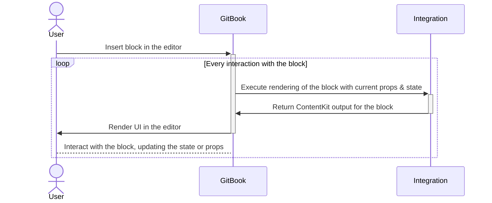

# Concepts

Throughout the GitBook developer platform and its documentation, you'll encounter various concepts, variables, and terms.

<table><thead><tr><th width="228.12109375" valign="top">Term</th><th width="234.39453125" valign="top">Description</th><th width="339.8984375" valign="top">Where to Find</th></tr></thead><tbody><tr><td valign="top"><code>&#x3C;organizationId></code></td><td valign="top">A unique identifier of an Organization in GitBook.</td><td valign="top">Found in the URL of any space or via the "Copy org ID" button in the organization settings.  Example: <code>https://app.gitbook.com/o/&#x3C;organizationId/s/&#x3C;sapceId></code></td></tr><tr><td valign="top"><code>&#x3C;spaceId></code></td><td valign="top">A unique identifier of a Space in GitBook.</td><td valign="top">Found in the URL of any space or via the "Copy space ID" button in the upper-right dropdown in a space.  Example: <code>https://app.gitbook.com/o/&#x3C;organizationId/s/&#x3C;sapceId></code></td></tr><tr><td valign="top"><code>&#x3C;userId></code></td><td valign="top">A unique identifier of a User in GitBook.</td><td valign="top">Retrieved from the "GET Current User" API endpoint or via the "Copy user ID" button from your organization settings.</td></tr><tr><td valign="top"><code>gitbook-manifest.yaml</code></td><td valign="top">A required file in a GitBook integration containing metadata for publishing and developing your app.  Automatically generated from the CLI when running <code>gitbook new</code>.</td><td valign="top">See the <a href="../integrations/configurations.md"><strong>Configurations</strong></a> section for more info.</td></tr><tr><td valign="top"><code>.gitbook-dev.yaml</code></td><td valign="top">A required file in a GitBook integration that includes configuration for local development.  Automatically generated from the CLI when running <code>gitbook dev</code>.</td><td valign="top">See the <a href="../getting-started/development.md"><strong>Development</strong></a> section for more info.</td></tr></tbody></table>

### How integrations are rendered in GitBook

Rendering of custom blocks is controlled in the integration's code and executed in the GitBook backend.

